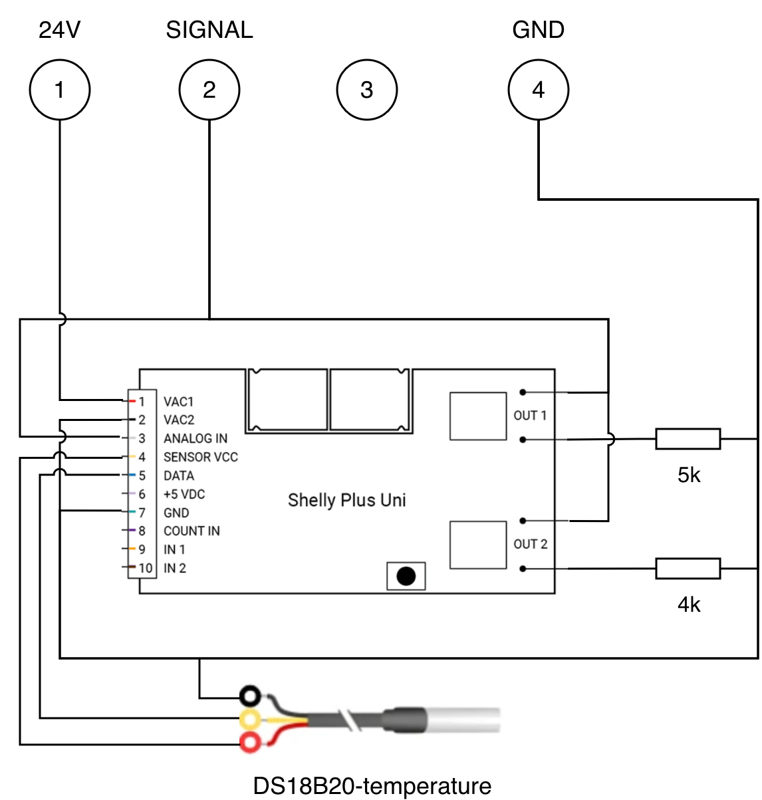
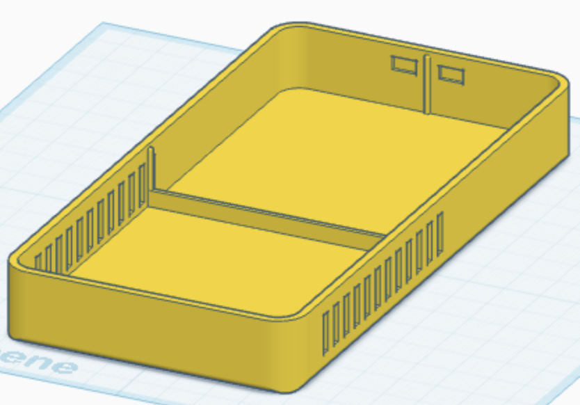

# Smarte Junkers Gastherme

> Read this in English: [README.md](README.md)

Dokumentation, wie ich meine alte **Junkers-/Bosch-Gastherme** smart
gemacht habe: Das modulierende Raumthermostat **Junkers TRQ 21** wurde
durch einen **Shelly Plus Uni** an der **1-2-4-Schnittstelle** ersetzt.
Vier Heizstufen (Aus / Niedrig / Mittel / Hoch),
Raumtemperatur­messung per **DS18B20**, anbindbar an **Home Assistant**,
MQTT oder die Shelly-Cloud.

Passend für ältere Junkers-/Bosch-Thermen mit 1-2-4-Schnittstelle –
z. B. die Baureihen **ZWR**, **ZSBE**, **ZWN**, **ZWA**.

> **Disclaimer:** Das hier ist meine persönliche Doku, kein Nachbau-Tutorial.
> Wer an seiner Heizung schraubt, sollte wissen, was er tut – Nachbau auf
> eigene Gefahr.

## Ziel: 4 Heizstufen mit Frostschutz-Failsafe

Statt der modulierenden Regelung des TRQ 21 sollen mit dem Shelly Plus Uni
**vier diskrete Heizstufen** abgebildet werden – **Hoch**, **Mittel**,
**Niedrig** und **Aus**. Die Schaltung ist dabei bewusst so ausgelegt,
dass die Therme bei einem Ausfall des Shelly (stromlos, defekt) **mit
voller Leistung weiterheizt** statt aus zu gehen: Frostschäden an
Heizungs- und Wasserleitungen sind deutlich teurer als zeitweises
Überheizen, das durch Heizkörper-Thermostatventile ohnehin begrenzt wird.

Die zwei schaltbaren Ausgänge des Shelly werden in allen vier
Kombinationen genutzt – aktive Pulldowns zwischen Klemme **2** (Signal)
und Klemme **4** (GND) ziehen die Spannung von der Failsafe-Volllast
schrittweise nach unten:

| Stufe       | Ausgang 1 | Ausgang 2 | aktiver Pulldown zwischen 2 ↔ 4 |
| ----------- | :-------: | :-------: | ------------------------------- |
| **Hoch**    |    aus    |    aus    | keiner (Klemme 2 offen)         |
| **Mittel**  |    ein    |    aus    | 5,1 kΩ                          |
| **Niedrig** |    aus    |    ein    | 4 kΩ (2 kΩ + 2 kΩ in Reihe)     |
| **Aus**     |    ein    |    ein    | 5,1 kΩ ∥ 4 kΩ ≈ 2,22 kΩ         |

Jede Stufe entspricht damit einem festen Spannungswert an Klemme 2 und
einer entsprechend festen Brennerleistung – die zugehörigen Spannungspegel
sind weiter unten unter [Messwerte und Stufenspannungen](#messwerte-und-stufenspannungen) dokumentiert.

## Das ersetzte Raumthermostat: Junkers TRQ 21

Der TRQ 21 ist ein **modulierender Raumtemperaturregler** für ältere Junkers-/Bosch-Gas­thermen.
Er misst die Raumtemperatur, vergleicht sie mit dem Sollwert und gibt der
Therme über eine analoge Stellgröße vor, **wie viel** sie heizen soll.

## Die 1-2-4-Schnittstelle

Der TRQ 21 ist über eine **dreiadrige Junkers-Schnittstelle** mit
der Therme verbunden. Der Name kommt von der Klemmenbezeichnung im
Anschlussplan: belegt sind die Klemmen **1**, **2** und **4** (Klemme 3
existiert auf der Leiste, wird aber nicht verwendet).

| Klemme | Bedeutung       | Beschreibung                                  |
| :----: | --------------- | --------------------------------------------- |
| **1**  | **+24 V DC**    | Versorgungsspannung von der Therme zum Regler |
| **2**  | **Stellsignal** | Analoge Rückspannung vom Regler zur Therme    |
| **4**  | **GND / Masse** | gemeinsame Bezugsmasse                        |

### So wird moduliert

Die Therme legt zwischen Klemme 1 und Klemme 4 ihre 24 V Versorgungsspannung
an und misst, **welche Spannung der Regler an Klemme 2 zurückgibt**. Diese
Spannung steuert direkt die Brennermodulation:

- **unter ~7 V**: Brenner **aus**
- **bis ~15 V**: Brennerleistung steigt bis **100 %** (höhere Spannung bringt keine  
  zusätzliche Leistung)

> **Failsafe-Verhalten:** Ist gar kein Regler angeschlossen
> – Klemme 2 also offen –, interpretiert die Therme das als Volllast­anforderung
> und heizt mit 100 %. Genau dieses Verhalten nutzt die Schaltung gezielt
> als Frostschutz: fällt der Shelly aus, schaltet die Therme automatisch
> auf Volllast.

## Ansteuerung mit Shelly Plus Uni

Statt eines TRQ 21 sitzt jetzt ein **Shelly Plus Uni** an der
1-2-4-Schnittstelle. Die Schaltung kommt ganz ohne aktive Elektronik aus –
der Shelly steuert nichts „analog" an Klemme 2, sondern verändert nur den
Spannungsteiler aus dem internen Pull-up der Therme und externen
Pulldown-Widerständen:

- **Kein dauerhafter Pulldown:** Klemme 2 ist im Ruhezustand offen. Der
  interne Pull-up der Therme zieht sie damit auf +21 V – dadurch heizt
  die Therme im Fehlerfall mit voller Leistung (Frostschutz-Failsafe).
- **Pulldowns über den Shelly:** Die beiden schaltbaren Ausgänge legen
  jeweils einen Widerstand zwischen Klemme **2** (Signal) und Klemme **4**
  (GND). Sind die Ausgänge nicht geschaltet – oder der Shelly stromlos –,
  sind die Pulldowns automatisch abgekoppelt. Je kleiner der wirksame
  Pulldown-Widerstand, desto stärker wird die Spannung an Klemme 2 nach
  GND gezogen – und desto niedriger die Brennerleistung.

### Messwerte und Stufenspannungen

Spannung an Klemme **2** für die vier Heizstufen, gemessen an meiner
Therme:

| Pulldown 2 ↔ 4          | Spannung an Klemme 2 | Stufe           | Brenner-Verhalten    |
| ----------------------- | -------------------- | --------------- | -------------------- |
| keiner (offen)          | **21,4 V**           | Hoch (Failsafe) | volle Leistung       |
| 5,1 kΩ                  | **10,5 V**           | Mittel          | an, moduliert        |
| 4 kΩ (2 kΩ + 2 kΩ)      | **9,3 V**            | Niedrig         | an, zündet auch kalt |
| 2,22 kΩ (5,1 kΩ ∥ 4 kΩ) | **6,4 V**            | Aus             | schaltet ab          |

Die Werte sind an meiner Therme gemessen – je nach Modell können sie
leicht abweichen.

#### Hysterese: zwei verschiedene Schwellen

Modulierende Brenner haben eine Hysterese – die Spannung, ab der ein
**kalter** Brenner zündet, ist höher als die, bei der ein **laufender**
Brenner abschaltet. Für meine Therme ergeben die Messungen:

- **Aus-Schwelle:** ~6 V → laufender Brenner geht aus
- **Hysterese-Zone:** ~6 – 9 V → Brenner bleibt an, falls er gerade
  läuft, kommt aber **nicht** aus dem Aus-Zustand wieder hoch
- **Zünd-Schwelle:** ~9 V → kalter Brenner zündet zuverlässig

**Für die Auslegung der Niedrig-Stufe ist das entscheidend:** R_b ist
gezielt so groß gewählt (4 kΩ), dass die Niedrig-Spannung (9,3 V)
**oberhalb der Zünd-Schwelle** liegt – der Brenner zündet aus dem
Aus-Zustand also auch direkt mit Niedrig zuverlässig. Ein kleinerer
R_b wie z. B. 3 kΩ würde Niedrig auf 7,8 V drücken und damit mitten
in die Hysterese-Zone: der Brenner liefe dann zwar weiter, falls er
schon brennt, käme aber aus dem Aus-Zustand nicht mehr von selbst hoch.

#### Charakterisierungs-Messreihe

Vollständige Messreihe an meiner Therme:

| Pulldown 2 ↔ 4    | Spannung an Klemme 2 | Brenner-Verhalten                   |
| ----------------- | -------------------- | ----------------------------------- |
| keiner (offen)    | 21,4 V               | an, volle Leistung                  |
| 10 kΩ             | 14 V                 | an (Modulations-Sättigungs­bereich) |
| 5,1 kΩ            | 10,5 V               | an, moduliert                       |
| 4 kΩ              | 9,3 V                | zündet auch kalt zuverlässig        |
| 3 kΩ              | 7,8 V                | bleibt an, zündet aber nicht kalt   |
| 2,22 kΩ (5,1 ∥ 4) | 6,4 V                | schaltet ab (aus dem Lauf)          |
| 2 kΩ              | 5,9 V                | schaltet ab (aus dem Lauf)          |
| 1,88 kΩ (5,1 ∥ 3) | 5,7 V                | schaltet ab (aus dem Lauf)          |
| 1 kΩ              | 3,5 V                | schaltet ab (aus dem Lauf)          |

### Spannungsüberwachung

Der Shelly Plus Uni hat zusätzlich zu den beiden Schaltausgängen einen
**analogen Spannungseingang (0–30 V DC)**. Damit lässt sich die Spannung
zwischen Klemme **2** und Klemme **4** direkt mitloggen – also genau das
Signal, mit dem die Therme moduliert. So kann jederzeit überprüft werden,
in welcher Stufe sich die Therme tatsächlich befindet, und sowohl die
Therme als auch die eigene Schaltung lassen sich aus der Ferne überwachen.

## Raumtemperatur per DS18B20

Mit dem Wegfall des TRQ 21 entfällt auch dessen interne
Raumtemperatur­messung. Diese Aufgabe übernimmt ein **DS18B20**, der direkt am Shelly hängt.  
Diese Temperatur kann später in einer Automatisierung verwendet werden, um zu entscheiden,
welcher Ausgang geschaltet werden soll.

Die exakte Verdrahtung ist im [Schaltplan](#schaltplan-und-pinbelegung)
zu sehen.

## Schaltplan und Pinbelegung

Die komplette Verdrahtung ist in [`images/wiring.png`](images/wiring.png)
dargestellt (bearbeitbare Quelle: [`images/wiring.drawio`](images/wiring.drawio)):

### Anschluss an die Therme

Oben im Bild liegen die vier Klemmen der Therme. Genutzt werden nur **1**,
**2** und **4**; **Klemme 3** bleibt frei.

- **Klemme 1 (24 V)** versorgt den Shelly über VAC1.
- **Klemme 2 (Signal)** wird über die beiden Shelly-Ausgänge bei Bedarf
  über die Pulldown-Widerstände nach Klemme 4 (GND) gezogen. Die gleiche Leitung 
  geht zusätzlich auf den Shelly-Pin **ANALOG IN** zur Spannungsmessung.
- **Klemme 4 (GND)** ist die gemeinsame Masse für Therme, Shelly-Versorgung,
  DS18B20 und die geschalteten Pulldowns.

### Pinbelegung Shelly Plus Uni

Der Shelly Plus Uni hat einen 10-poligen Stecker mit farbcodierten Adern.
In dieser Schaltung sind sechs der zehn Adern belegt:

|  Pin  | Bezeichnung | Aderfarbe | Verwendung                                        |
| :---: | ----------- | --------- | ------------------------------------------------- |
|   1   | VAC1        | rot       | → Therme **Klemme 1** (+24 V) – Shelly-Versorgung |
|   2   | VAC2        | schwarz   | → Therme **Klemme 4** (GND) – Shelly-Versorgung   |
|   3   | ANALOG IN   | grau      | → Therme **Klemme 2** (Signal) – Spannungsmessung |
|   4   | SENSOR VCC  | gelb      | → DS18B20 **rote** Ader (Sensor-Versorgung)       |
|   5   | DATA        | blau      | → DS18B20 **gelbe** Ader (1-Wire Datenleitung)    |
|   6   | +5 VDC      | -         | unbenutzt                                         |
|   7   | GND         | grün      | → DS18B20 **schwarze** Ader (Sensor-Masse)        |
|   8   | COUNT IN    | -         | unbenutzt                                         |
|   9   | IN 1        | -         | unbenutzt                                         |
|  10   | IN 2        | -         | unbenutzt                                         |

Zusätzlich hat der Shelly **zwei potentialfreie Relaisausgänge**. Beide
schalten ihren Widerstand jeweils zwischen Klemme **2** und Klemme **4** (Pulldown):

| Ausgang       | geschalteter Pulldown zwischen Klemme 2 ↔ Klemme 4 | Heizstufe       |
| ------------- | -------------------------------------------------- | --------------- |
| beide aus     | offen (kein Pulldown)                              | Hoch (Failsafe) |
| **OUT 1**     | **5,1 kΩ**                                         | Mittel          |
| **OUT 2**     | **4 kΩ** (2 kΩ + 2 kΩ in Reihe)                    | Niedrig         |
| OUT 1 + OUT 2 | 5,1 kΩ ∥ 4 kΩ ≈ 2,22 kΩ                            | Aus             |

## 3D-gedruckte Abdeckung

Als optischer Ersatz für den TRQ 21 habe ich eine **3D-druckbare Abdeckung**
modelliert, die auf die **bereits vorhandene Wandhalterung** des
Original­thermostats gesteckt wird – keine neuen Bohrlöcher. 
Der Shelly Plus Uni und die komplette Verkabelung finden darunter Platz.

- [`cover.stl`](3d-printing/cover.stl) – druckfertiges Modell
- [`cover.png`](3d-printing/cover.png) – Vorschau-Rendering

## Quellen und weiterführende Informationen

- [Ansteuerung Junkers 1-2-4-Schnittstelle – mikrocontroller.net](https://www.mikrocontroller.net/topic/450569)
  – ausführliche Diskussion mit Messwerten, Spannungs- und Stromkennlinien
- [Control Junkers gas heating (1-2-4 interface) with Home Assistant – Home Assistant Community](https://community.home-assistant.io/t/control-junkers-gas-heating-1-2-4-interface-with-home-assistant/354658)
  – praktische Umsetzung per ESP8266/PWM und Optokoppler
- [Schaltplan Platine Junkers ZSBE 16-3 – roter-unimog.de](http://www.roter-unimog.de/p4/46-hzg-technik.htm)
  – Original-Schaltplan einer kompatiblen Therme inkl. Klemmenbelegung
- [Bedienungsanleitung TRQ 21 W (PDF) – ManualsLib](https://www.manualslib.com/manual/1229445/Junkers-Trq-21-W.html)
  – Hersteller­dokumentation des Original­reglers
- [KNX-User-Forum: TRQ 21 T und Gastherme ZWR 18-3/24-3](https://knx-user-forum.de/forum/%C3%B6ffentlicher-bereich/knx-eib-forum/knx-einsteiger/1132705-raumtemperaturregler-trq-21-t-und-gastherme-zwr-18-3-24-3-von-junkers-bosch)
  – Diskussion zur KNX-Anbindung der gleichen Schnittstelle
